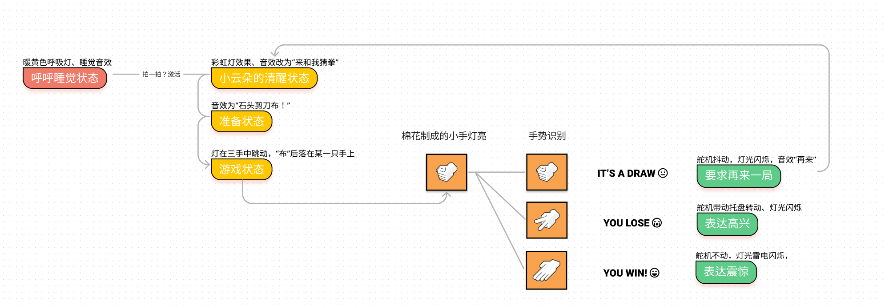
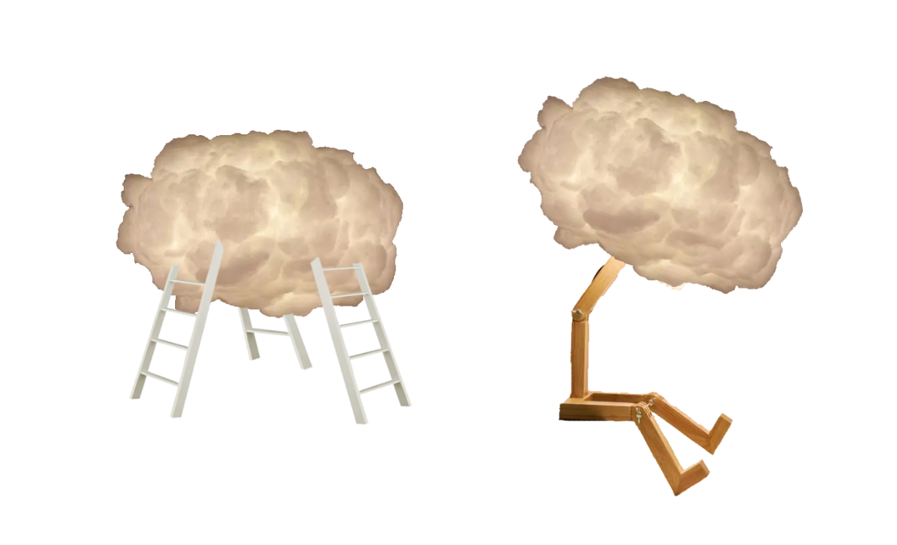
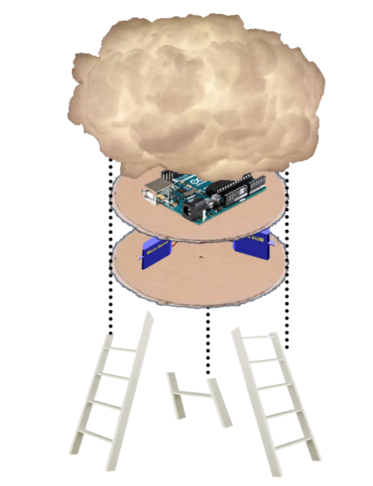

# Playing-rock-paper-scissors-with-arduino
I use mediapipe to recognise gestures in the upper computer and then send data via the serial port to the arduino, which controls the lights and sounds via the arduino. I completed a simple game of rock-paper-scissors where the upper computer recognises the gesture and then sends the information to the arduino to complete.
Structure

Cloud light design-P1

Cloud light design-P2
